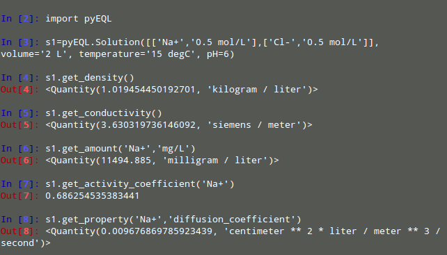

A human-friendly python interface for solution chemistry

## Description

pyEQL is a Python library that provides tools for modeling aqueous electrolyte
solutions. It allows the user to manipulate solutions as Python
objects, providing methods to populate them with solutes, calculate
species-specific properties (such as activity and diffusion coefficients),
and retrieve bulk properties (such as density, conductivity, or volume).

pyEQL is designed to be customizable and easy to integrate into projects
that require modeling of chemical thermodyanmics of aqueous solutions.
It aspires to provide a flexible, extensible framework for the user, with a
high level of transparency about data sources and calculation methods.

pyEQL runs on Python 3.8+ and is licensed under LGPL.

### Key Features

- Build accurate solution properties using a minimum of inputs. Just specify
  the identity and quantity of a solute and pyEQL will do the rest.

- "Graceful Decay" from more sophisticated, data-intensive modeling approaches
  to simpler, less accurate ones depending on the amount of data supplied.

- Not limited to dilute solutions. pyEQL contains out of the box support for
  the Pitzer Model and other methods for modeling concentrated solutions.

- Extensible database system that allows one to supplement pyEQL's default
  parameters with project-specific data.

- Units-aware calculations (by means of the [pint](https://github.com/hgrecco/pint) library)

### Documentation

Detailed documentation is available at [https://pyeql.readthedocs.io/](https://pyeql.readthedocs.io/)

### Dependencies

- Python 3.8+. This project will attempt to adhere to NumPy's
  [NEP 29](https://numpy.org/neps/nep-0029-deprecation_policy.html) deprecation policy
  for older version of Python.
- [pint](https://github.com/hgrecco/pint) - for units-awarecalculations
- [pymatgen](https://github.com/materialsproject/pymatgen) - periodic table and chemical formula information
- [iapws](https://github.com/jjgomera/iapws/) - equations of state for water
- [monty](https://github.com/materialsvirtuallab/monty) - serialization and deserialization utilities
- [maggma](https://materialsproject.github.io/maggma/) - interface for accessing the property database
- [scipy](https://www.scipy.org/) - for certain nonlinear equation solvers

<!-- pyscaffold-notes -->

## Note

This project has been set up using PyScaffold 4.5. For details and usage
information on PyScaffold see .
